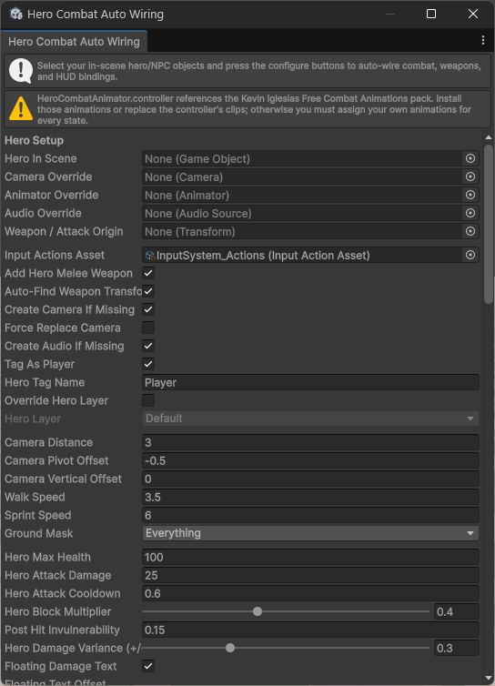
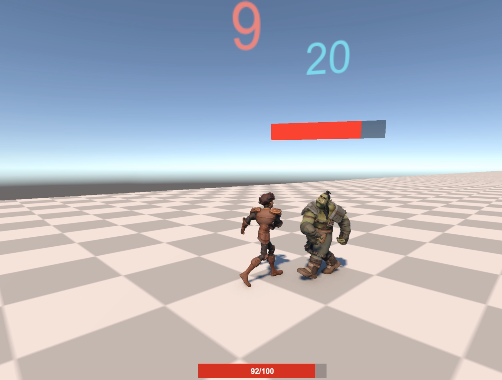

# Hero Combat Controller (UPM)

A drop-in third-person combat controller for Unity 6000.2+ that ships with runtime scripts, NPC AI, auto-wiring editor tooling, and reusable HUD/animation assets. This folder is self-contained so you can move it into its own Git repository and distribute it as a Unity Package Manager (UPM) package.

A full walkthrough with install and usage instructions can be found here: https://www.youtube.com/watch?v=a9bhad6asYA




## Contents

- **Runtime** – `HeroCharacterController`, combat agent, NPC AI, floating combat text, world-space health bars, prefabs, and the shared animator controller.
- **Editor** – the Hero Combat Auto Wiring window that configures heroes/NPCs, adds colliders, weapons, HUD bindings, and floating damage text with a single click.
- **Prefabs & Assets** – `Runtime/Prefabs/HeroCombatHUD.prefab` and `Runtime/Animation/HeroCombatAnimator.controller` are included so you can ship default UI/animation data with the package.

## Install (UPM)

1. Open Unity Package Manager (Window->Package Management->Package Manager)
2. Click the "+" icon in the upper left, and choose "Install package from git URL"
3. Paste this URL into the field and Click install
   ```json
   "https://github.com/mdj128/hero-combat-controller.git"
   ```
4. Unity will import the runtime/editor assemblies automatically. Enable the Input System package if it isn’t already installed.

## Quick Start

1. Drop the **HeroCombatHUD** prefab into your canvas (optional – Hero HUD only).
2. Run **Hero Character → Combat Auto Wiring** from the Unity menu.
3. Select your hero GameObject and click **Configure Hero** – this adds the controller, Input System bindings, floating damage text, and sets up the camera.
4. Select an enemy prefab and click **Configure NPC** – this wires NPC combat, animator driver, melee weapon (auto-finding the right-hand bone by default), floating text, and a world-space health bar.
5. Enter Play Mode and use your existing animations/rigs with the provided controller + HUD.

## Crosshair & Interactables

- A lightweight crosshair now auto-attaches to the hero camera when the controller is enabled. Tweak size/colour in the **Crosshair** foldout on `HeroCharacterController` or disable it entirely.
- Press the **Interact** input (default action name `Interact`) while looking at an object on the interactable layer. The controller sphere-casts from the crosshair’s viewport anchor (default 0.55, 0.52) so it lines up with an over-the-shoulder reticle.
- Add `HeroInteractableObject` to any GameObject to fire UnityEvents when the hero interacts, or implement `IHeroInteractable` for custom behaviour.
- Movement now supports over‑the‑shoulder strafing/backpedal by default (`Movement → Face Camera Forward`). Disable that toggle if you prefer turn-in-place locomotion.
- Animation controller: use `Runtime/Animation/HeroCombatAnimator2.controller` to get the 2D MoveX/MoveY blend trees for full directional walk/run (strafe/backpedal) support.
- Stamina system: sprinting and jumping drain stamina; the HUD now shows a yellow stamina bar on HeroCombatHUD.
- Dodge / Roll: add an Input System action named `Dodge` (or change `Input → Dodge Action`) and add an Animator trigger parameter named `Roll` (or change `Animation → Roll Trigger`). Create an Any State → Roll transition driven by that trigger, and exit back to locomotion after the clip.

## Default Input Bindings (UPM)

Unity packages can’t reliably modify a project’s Input Actions automatically on install. Instead, this package’s auto-wiring tool will create a project-local `InputActionAsset` at `Assets/HeroCharacter/HeroCombatInputActions.asset` if you don’t already have one.

Defaults include:
- `Dodge` bound to `Q`
- `Interact` bound to `E`
- WASD movement, mouse look, space jump, shift sprint, mouse buttons attack/block (plus basic gamepad bindings)

## Release Notes

### 1.2.0
- Added stamina system (drain on sprint/jump, regen when resting) with HUD bar.
- HUD prefab updated; binder listens to new stamina events.

### 1.1.0
- Added HeroCombatAnimator2.controller with 2D MoveX/MoveY locomotion blends.
- Crosshair anchor offset and interaction ray now match over-the-shoulder framing.
- Strafing/backpedal defaults enabled; look ease-in option added to reduce camera bounce on start.

## Requirements

- Unity **6000.2 LTS** or newer
- **Input System** package (`com.unity.inputsystem`)
- (Recommended) Kevin Iglesias free animation packs:
  - [Human Basic Motions](https://assetstore.unity.com/packages/3d/animations/human-basic-motions-free-154271)
  - [Human Melee Animations](https://assetstore.unity.com/packages/3d/animations/human-melee-animations-free-165785)

The included `HeroCombatAnimator.controller` references clips from those packs. If you skip them, swap in your own animations for every state inside the controller.

For full documentation and samples see the original repository or the comments in the scripts.
